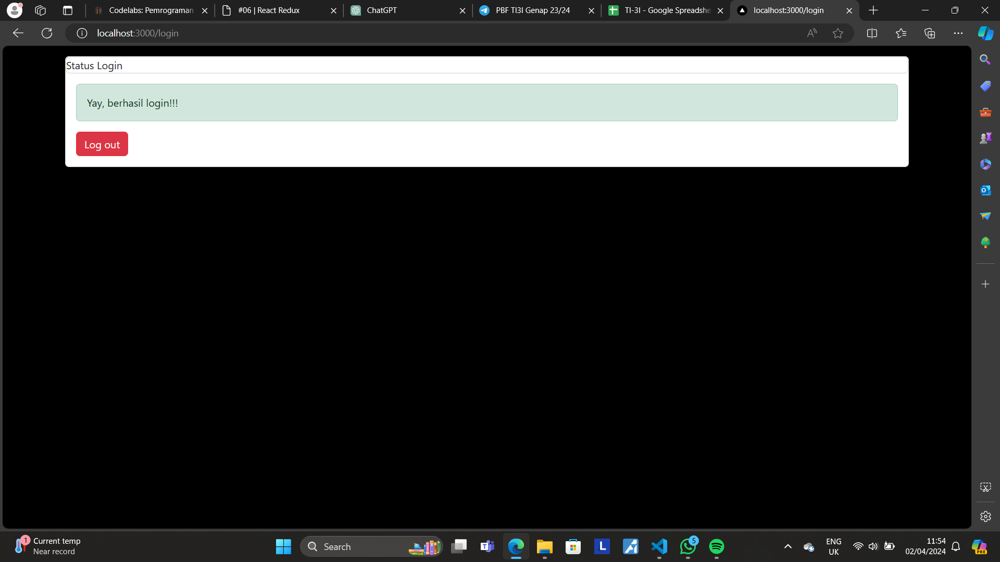

This is a [Next.js](https://nextjs.org/) project bootstrapped with [`create-next-app`](https://github.com/vercel/next.js/tree/canary/packages/create-next-app).

## Getting Started

First, run the development server:

```bash
npm run dev
# or
yarn dev
# or
pnpm dev
# or
bun dev
```

Open [http://localhost:3000](http://localhost:3000) with your browser to see the result.

You can start editing the page by modifying `pages/index.tsx`. The page auto-updates as you edit the file.

[API routes](https://nextjs.org/docs/api-routes/introduction) can be accessed on [http://localhost:3000/api/hello](http://localhost:3000/api/hello). This endpoint can be edited in `pages/api/hello.ts`.

The `pages/api` directory is mapped to `/api/*`. Files in this directory are treated as [API routes](https://nextjs.org/docs/api-routes/introduction) instead of React pages.

This project uses [`next/font`](https://nextjs.org/docs/basic-features/font-optimization) to automatically optimize and load Inter, a custom Google Font.

## Practicum Report

|  | Framework Based Programming 2024 |
|--|--|
| NIM |  2141720067|
| Nama |  Saefulloh Fatah Putra Kyranna |
| Kelas | TI - 3I |

## Practicum 1

In this practicum, we will install Redux and Bootstrap and implement it in our website. Once we install Bootstrap, we will import it and implement it in our website. 


When the button is clicked, a pop-up window will appear


## Practicum 2

In this practicum, we will implement login functionality using Redux. To do this, we have to create multiple files and a login page. Based on the provided code in the Codelabs, there are some error when opening login page, but this could be remedied by adding Provider in the _app.tsx file. 

`_app.tsx`

```bash
import { Provider } from 'react-redux';
import { store } from '../redux/store/store';
import "bootstrap/dist/css/bootstrap.min.css";
import "@/styles/globals.css";
import type { AppProps } from "next/app";
import { useEffect } from "react";

function myApp({ Component, pageProps }: AppProps){
  useEffect(() =>{
    require("bootstrap/dist/js/bootstrap.bundle.min.js");
  }, []);

  return (
  <Provider store={store}>
    <Component {...pageProps} />
  </Provider>
  );
}

export default myApp;
```

1. With these fixes, the output will look like this. 

`Login`


`Logout`



The output is the different state the website is in after navigating to the page. When we press the button, the button will do the `handleAuth` function and alternates between Login and Logout state. 

2. In line 25 and 30, there is a parse function as follows: 

```bash
parse('<div class="alert alert-success">Yay, berhasil login!!!</div>'),
```

```bash
parse('<div class="alert alert-dark">Anda telah logout</div>'),
```

This is done to render those elements as JSX elements with background. If we didn't add the `parse`, it will be rendered as normal HTML strings. 

## Practicum 03

In this practicum, we will implement a functionality called a counter as an implementation of how to manage state using Redux in Next.js. To do this, we must first need to create a slice called naikTurunSlice in Next.js. 

```bash
import { createSlice } from "@reduxjs/toolkit";

export const naikTurunSlice = createSlice({
    name: 'CounterNaikTurun', 
    initialState: {
        totalCounter: 0
    }, 
    reducers: {
        tambahCounter(state){
            state.totalCounter += 1;
        },
        kurangCounter(state){
            state.totalCounter -= 1;
        }
    },
});

export const { tambahCounter, kurangCounter } = naikTurunSlice.actions;
export default naikTurunSlice.reducer;
```

Once finished, we can then modify our store.js to include the Redux reducer and create a page to implement the counter. 

Output: 

`Initial State`


`After Addition`


`Performing Subtraction When the Counter is 0 `


## Practicum Questions

1. What is the use of the following code `import { useEffect } from` `"react";` on `file pages/_app.tsx?` Explain!
**Answer**: The use of the code is to perform data fetching in function components. In this case, the fetched data is the data containing configuration files for bootstrap so that we can implement it in the website. 
2. If this file `file pages/_app.tsx` doesn't use `useEffect` (deleting row 3 and row 9-11), what will happen?
**Answer**: If the `useEffect` is not implemented, then the program cannot run because the required bootstrap configuration data is not available due to the `useEffect` being deleted. Therefore, the program must run without `useEffect` or implement the `useEffect` first. 
3. Why the HTML tagging for `class` in react/nextjs must be replaced with `className`?
**Answer**: `className` is used instead of `class` because this is the JSX tag for `class` in HTML. If we don't use this tag, Next.js won't read our inline HTML code and thus would return an error. 
4. Can store in nextjs can save many redux reducer? 
**Answer**: Yes, we can store many redux reducer in `store.js`. They could be stored in the same function or in different ones. 
5. Explain the use of `store.js` file!
**Answer**: `store.js` file is used to manage the state with Redux by the use of multiple reducers. This is done so that every action by the user returns a different state and different display of the website. `store.js` can also be used for various other purposes, such as data persistence, shared logic via custom hooks, API integration, global variables and constants, and storing utility functions. 
6. On the `pages/login.tsx` file, what is the meaning of the following code ?
`const { isLogin } = useSelector((state) => state.auth);`
**Answer**: The use of the following code is to retrieve the state the website is in, then alternate the state of the website whenever the user performs an action to change the state in the website. In this case, auth means authorize, so this function is made for Login/Logout process. 
7. On the `pages/counter.tsx` file, what is the meaning of the following code ?
`const {totalCounter} = useSelector((state) => state.counter);`
**Answer**: The use of the following code is to retrieve the state the website is in, then alternate the state of the website whenever the user performs an action to change the state in the website. In this case, there is a counter on the state, so this will change the state of the counter based on the user's actions. 